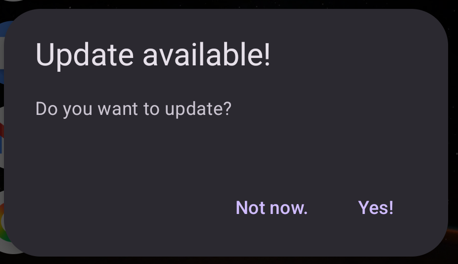

# Version Checker Lib
That's a version checking library for Android.

That library requires:

1. Internet permission `<uses-permission android:name="android.permission.INTERNET" />`

2. Material Dialog `import com.google.android.material.dialog.MaterialAlertDialogBuilder;`

## How to use it?
You have to extend abstract class
`com.lib.version.checker.AbstractVersionChecker`
and implement required methods.

Use example:
```
package com.app.example;

import android.app.Activity;
import com.lib.version.checker.AbstractVersionChecker;

public class VersionChecker extends AbstractVersionChecker {
    public VersionChecker(Activity activity) {
        super(activity);
    }

    @Override
    protected String NewVersionWebpageUrl() {
        return "https://yourserver/path/to/your/new/version/supplier";
    }

    @Override
    protected String latestVersionFileWebUrl() {
        return "https://yourserver/path/to/your/newer/version/file";
    }
}

```

And then you call:
```
new VersionChecker(this).checkVersionAsynchronously();
```

If there's a new version, a MaterialAlertDialog will show with two options.

Option 1: Takes user to download page.

Option 2: Dismisses dialog but shows normally next time.

